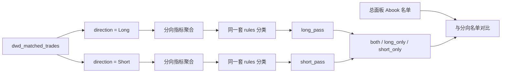

# Long/Short 分向独立筛选面板计划

## 目标

从 `risk.dwd_matched_trades` 原始成交按 `direction ∈ {Long, Short}` 拆成两套独立事实表，**用与总面板相同的筛选窗口、平台、默认规则各跑一遍用户筛选**，回答：

- 只看多单，谁过线？
- 只看空单，谁过线？
- 谁两边独立筛选都过（`both_pass`）？
- 总面板 Abook 过线但分向不过的人，是否在“靠一边撑总账”？

本面板**只做诊断与名单对比，不修改 `book` / Abook 路由**。

**指标原则**：统计内容与现有 **总览（Abook 分析）**、**Book 分析 → 用户结构 / 盈亏结构** 保持同构，只是把事实集换成 Long 或 Short；**不做 markout**。

## 核心口径（锁定）



1. **事实来源**：分向筛选期/验证期的交易数、盈亏、胜负、持仓、品种、日/月曲线、集中度，**全部只来自该方向的 matched 行**。
2. **P&L 定义**：`side_pnl = sum(matched.profit)`（该方向）。**不混入** `ods_mt5_deals` 的 `client_net_pnl` / storage / commission / fee。面板明确标注“matched profit 口径”，避免与总面板客户净 P&L 对账误解。
3. **日桶**：按该方向成交的 `toDate(exit_time)` 聚合日 P&L（与现有 matched 行为指标时间轴一致）。
4. **规则复用**：与总面板相同的 `AnalysisRequest` 默认值（筛选 5–6 月、验证 7 月、`min_trades=75`、`min_win_rate=0.5`、`min_profit_factor=1.25`、`min_payoff_ratio=0.4`、`max_top1_day_profit_contribution=0.3`、杠杆/马丁等）。每侧独立套用交易质量门槛。
5. **账户级闸门共用**：杠杆快照、马丁硬拦截、个人/新闻名单、R4（若开启）按账户一次判定，Long/Short 两侧结果共享；**不因方向重算马丁/杠杆**。
6. **样本不足**：某一侧 `trade_count = 0` 记为 `no_side_activity`；`0 < trade_count < min_trades` 记为 `insufficient_side`，**不算 pass，也不算 neither 里的“质量失败”**，单独计数。

## 与现有代码的挂载点

- 现有总查询在 [`app/queries.py`](app/queries.py) 的 `matched` CTE 已有 `direction`，但按账户月汇总，未按方向拆事实。
- 分类逻辑在 [`app/service.py`](app/service.py) 的 `build_two_stage_payload` / `normal_abook_rules_pass`（约 1317–1327 行），依赖 `selection.trade_count / win_rate / profit_factor / payoff_ratio / top_positive_day_concentration` + 杠杆。
- 总面板 P&L 来自 deals；分向面板需**新查询路径**：`matched WHERE direction = ...` 同时产出月事实与日事实，再喂入同一套 `_account_period_metrics` 风格聚合（`client_net_pnl` 字段在分向模式下映射为 `side_pnl`）。
- 前端侧边栏默认参数在 [`frontend/src/App.vue`](frontend/src/App.vue)；新 Tab 复用同一 `AnalysisRequest`，懒加载分向结果。

建议新增：

- `app/queries.py`：`build_direction_matched_facts_query(direction: Literal["Long","Short"])` — 月 + 日聚合
- `app/direction_analytics.py`：分向聚合、分类、四象限、与总 Abook 对比
- `POST /api/abook/direction-analytics`：独立接口（类似 book-analytics 懒加载）
- 前端 `DirectionPanel.vue` Tab

## 筛选判定（每侧独立）

对 `side ∈ {long, short}`，筛选期：

```text
side_pass =
  trade_count >= min_trades
  AND profit_factor > min_profit_factor   -- 或无亏损时按现有 _profit_factor 语义
  AND win_rate >= min_win_rate
  AND payoff_ratio >= min_payoff_ratio
  AND top1_day_profit_contribution < max_top1_day_profit_contribution
  AND leverage_filter_pass(account)      -- 账户级共用
  AND NOT martingale_hard_block          -- 账户级共用
```

诊断项（展示、不挡 pass，与总面板现行一致）：日盈利率 Wilson、月度一致性、稳定性分、`avg_profit` 等。

象限：

| 标签 | 条件 |
|------|------|
| `both_pass` | long_pass ∧ short_pass |
| `long_only_pass` | long_pass ∧ ¬short_pass ∧ short 非 insufficient/no_activity 或 short 明确未过 |
| `short_only_pass` | 对称 |
| `insufficient_side` | 至少一侧样本不足且无任一侧 pass（或单独子标签 `long_insufficient` / `short_insufficient`） |
| `neither_pass` | 两侧样本均达标但都未过质量门槛 |

与总面板对比（账户键 `(platform, login)`）：

- `total_abook ∩ both_pass`
- `total_abook ∩ long_only_pass` / `short_only_pass`（单边幻觉候选）
- `both_pass \ total_abook`（总规则未进 Abook、但分向双边都过）

## 指标集（对齐总览 + 用户结构，不做 markout）

原则：字段与现有 [`AbookAnalysis.vue`](frontend/src/components/AbookAnalysis.vue)、[`book_analytics.py`](app/book_analytics.py) 的 `pnl_structure` / `user_structure` **同名同义**；Long、Short 各产出一套。P&L 字段语义为该方向 `matched.profit`（展示时标注口径）。**整面板不做 markout。**

### 1. 账户级（对齐总览用户表 / 筛选规则字段）

每侧 × 筛选期/验证期：

- `trade_count` / `winning_trades` / `losing_trades`
- `side_pnl`（对应总览里的阶段 P&L 角色）
- `win_rate` / `profit_factor` / `payoff_ratio`
- `gross_wins` / `gross_losses`
- `top_positive_day_concentration`（Top1 日贡献，筛选用）
- `active_trade_days`
- `median_holding_seconds` / `avg_holding_seconds`
- `total_volume` / `symbols_traded`
- `positive_day_rate` / `daily_positive_days` / `daily_negative_days` / `daily_flat_days`（总览诊断同款，不挡路由）
- `max_drawdown`（该侧累计）
- `sample_status`：`ok` | `insufficient` | `no_activity`
- 账户级共用（不按方向拆）：`risk_leverage_p95_ratio`、马丁状态、稳定性分（诊断）

跨侧一行（方向面板增量，总览没有）：

- `quadrant`：`both_pass` / `long_only_pass` / `short_only_pass` / `neither_pass` / `insufficient_side`
- `long_trade_share` / `short_trade_share`
- `in_total_abook`：是否在总面板 Abook 名单
- `selection_flags_long` / `selection_flags_short`：未过原因

### 2. 名单汇总（对齐总览阶段卡片 / Book 盈亏结构）

对 `long_pass` / `short_pass` / `both_pass` / `long_only` / `short_only` 及筛选期/验证期：

- 用户数、`active_accounts`
- `profitable_accounts` / `loss_accounts` / `neutral_accounts`（中性带与现网一致，±10）
- `positive_pnl` / `negative_pnl` / `net_pnl`
- `average_pnl` / `median_pnl`
- `matched_trades`、汇总 `win_rate` / `profit_factor`
- `max_drawdown`、最差单日 P&L（有日序列时）
- Top 集中度 `profit_concentration`（top5/10/20，同 book analytics）
- P&L 分桶分布（同 `PNL_BUCKETS`）
- 与总 Abook 重叠：`overlap_both` / `abook_but_one_sided` / `both_but_not_abook` 人数与验证期净 P&L

### 3. 用户结构（对齐 Book「用户结构」Tab）

对上述各名单集合，按侧或按象限展示：

- `styles`：scalping / high_frequency / swing / martingale / normal（复用 `_style()`，持仓与交易数来自该侧 selection）
- `style_breakdown`：各风格人数、净 P&L、胜率、PF
- `holding_duration_bins`：持仓分桶
- `trade_volume_bins`：交易量分桶
- `symbol_heatmap`：该方向 matched 的品种 trade_count / volume / market_pnl
- Top winners / losers 账户列表（同 `_top_accounts`）

### 4. 明确不做

- **Markout**（entry/exit 各 offset）— 不做
- 分向 deals `client_net_pnl` / 成本拆分 — 不做
- 分向改写主 Abook `book` — 不做
- 账户详情里的 de_extreme、小时桶贡献、事件窗 — 不做（总览/用户结构未作为主面板指标）
- 分向重算 R4 — 不做（账户级共用即可）

## 面板信息架构

布局对齐现有两块，方向维度替换 book 维度：

1. **总览区**（仿 Abook 分析）：Long / Short / Both 阶段净 P&L、赚亏人数；用户表列两侧 trades、胜率、PF、P&L、象限、是否总 Abook
2. **用户结构区**（仿 Book 用户结构）：风格分布、持仓/交易量分桶、品种热力、Top 盈亏用户 — 可切换查看 Long 过线集 / Short 过线集 / Both
3. **对比一行**：总 Abook vs `both_pass` 验证期净 P&L 与继续盈利人数
4. **导出 CSV**：账户键 + 两侧门槛指标 + 象限 + `in_total_abook`

## 实现阶段

1. **Spec + 指标契约**：本计划落地为 `docs/superpowers/specs/2026-07-21-long-short-direction-panel-design.md`（实现前可再抄一份正式 spec）；pytest 锁定字段名与象限规则。
2. **SQL**：按 direction 过滤的月/日 matched 事实查询；Long、Short 两次取数（或一次查出带 direction 维度再在内存拆）。
3. **服务**：`build_direction_analytics_payload` — 聚合 → 每侧 classify → 象限 → 与已有分析 context 的 Abook 名单求交。
4. **API**：`POST /api/abook/direction-analytics`，body 同 `AnalysisRequest`。
5. **前端**：Direction Tab，复用侧边栏参数；首次进入懒加载。
6. **验收**：FakeRepository 单测覆盖 both/long_only/insufficient；真实库抽数核对某 login 多空笔数与手动 SQL 一致。

## 验收标准

- 同一默认参数下，Long 筛选结果不依赖 Short 成交，反之亦然。
- `both_pass` 中每个账户两侧 `trade_count >= 75` 且质量门槛各自独立满足。
- 面板文案标明 matched profit，不与总面板 deals 客户净 P&L 混称。
- 主分析 `/api/abook/analysis` 的 `book` 字段行为不变。
